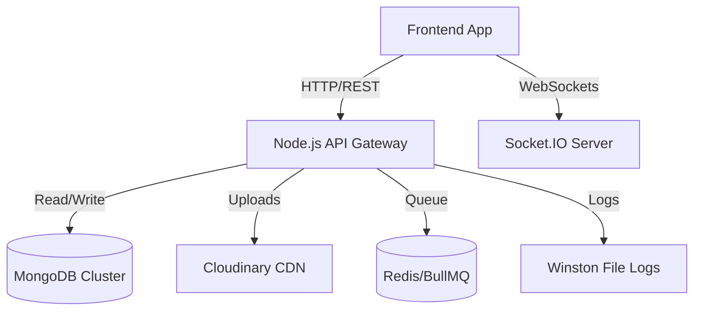

# 🎓 Aluminati - Intelligent Alumni Network Platform

> **Production-Ready | Scalable | AI-Powered**
>
> Bridging the gap between students and alumni through smart matching, real-time communication, and data-driven insights.

[](LICENSE)
[](https://nodejs.org/)
[]()


## 🚀 Why This Project Stands Out?

Built with a focus on **Scalability** and **Real-World Engineering**, Aluminati goes beyond a simple CRUD app.

*   **⚡ High Performance**: Optimized with **MongoDB Compound Indexes** and **Redis-ready Caching**.
*   **🛡️ Enterprise-Grade Security**: **RBAC** (Role-Based Access Control), **Rate Limiting**, **Input Validation**, and **Centralized Error Handling**.
*   **🧠 AI Smart Matching**: Custom algorithm ranks jobs based on **Skills + Experience + Location**.
*   **📈 Real-Time & Interactive**: Socket.IO powered **Chat** (with Typing Indicators & Read Receipts) and live notifications.
*   **📝 Developer Experience**: Fully documented API via **Swagger UI** and structured **Winston Logging**.

---

## ✨ Key Features

### 🔔 **Core Platform**
*   **Smart Job Matching**: "Top Picks" for you based on a weighted scoring algorithm (+15pts Experience, +10pts Skills).
*   **Verification System**: Admin-controlled verification badges (Blue Tick) for trusted alumni.
*   **Network Analytics**: Data visualization APIs for user growth and engagement trends.
*   **Real-time Chat**: Connect instantly with `socket.io` (Online status, Read receipts).

### 🤖 **"Wow" Features**
*   **AI Chatbot**: Built-in assistant for FAQs (Job application help, Password reset).
*   **Cloudinary Integration**: Secure, scalable image uploads for profiles and posts.
*   **Automated CI/CD**: GitHub Actions workflow for automated testing.

---

## 🛠️ Tech Stack

| Domain | Technologies |
| :--- | :--- |
| **Backend** | Node.js, Express.js (ES Modules) |
| **Database** | MongoDB (Mongoose ODM) |
| **Real-time** | Socket.IO |
| **Storage** | Cloudinary (Image Hosting) |
| **Docs & Logs** | Swagger (OpenAPI), Winston (JSON Logs) |
| **Testing** | Jest, Supertest |
| **Security** | BCrypt, JWT, Helmet, Express-Rate-Limit, Express-Validator |
| **Scaling** | BullMQ (Queue Structure), Redis (Ready) |

---

## 🏗️ System Architecture

### High-Level Design


---

## 📦 Installation & Setup

### Prerequisites
*   Node.js (v16+)
*   MongoDB (Local or Atlas)
*   Cloudinary Account (Optional, for image uploads)

### Steps

1.  **Clone the Repo**
    ```bash
    git clone https://github.com/your-username/aluminati.git
    cd aluminati
    ```

2.  **Install Dependencies**
    ```bash
    npm install
    cd backend && npm install
    ```

3.  **Configure Environment**
    Create a `.env` file in the root:
    ```env
    PORT=5000
    MONGO_URI=mongodb://localhost:27017/aluminati
    JWT_SECRET=your_super_secret_key
    
    # Cloudinary (Optional)
    CLOUDINARY_CLOUD_NAME=your_name
    CLOUDINARY_API_KEY=your_key
    CLOUDINARY_API_SECRET=your_secret
    ```

4.  **Run the Server**
    ```bash
    # Development Mode (with Nodemon)
    npm run dev
    ```

5.  **Explore API Docs**
    Visit `http://localhost:5000/api-docs` to interact with the Swagger UI.

6.  **Run Tests**
    ```bash
    npm test
    ```

---

## 📊 API Documentation

We use **Swagger/OpenAPI** for auto-generated documentation.

*   **Auth**: `/auth/register`, `/auth/login`
*   **Jobs**: `/api/jobs` (Supports Pagination: `?page=1&limit=10`)
*   **Chat**: `/api/messages`, `/api/chatbot/query`
*   **Admin**: `/api/admin/verify-user`, `/api/analytics/network-stats`

*(Visit `/api-docs` locally for the full interactive list)*

---

## 🔮 Future Roadmap (Phase 8+)

*   [ ] **Machine Learning**: Python service for advanced resume parsing.
*   [ ] **Mobile App**: React Native client.
*   [ ] **Video Interviews**: WebRTC integration.

---

<div align="center">
Made with ❤️ by Akshay Jain
</div>
