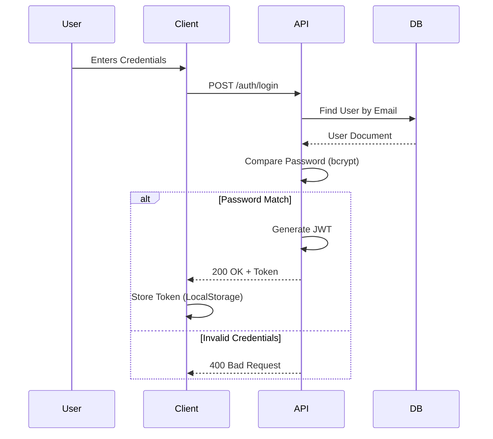

# Architecture Diagrams

## System Architecture

```mermaid
graph TD
    Client[Client App (Frontend)]
    API[Node.js / Express API]
    DB[(MongoDB Database)]
    Cloud[Cloudinary Storage]
    Socket[Socket.IO Realtime]

    Client -->|HTTP / JSON| API
    Client -->|WebSockets| Socket
    API -->|Mongoose| DB
    API -->|Upload| Cloud
    Socket -->|State| API
```

## Authentication Flow


